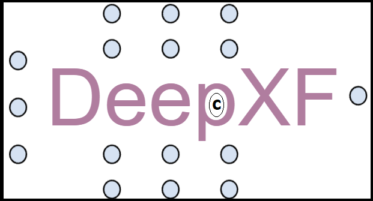
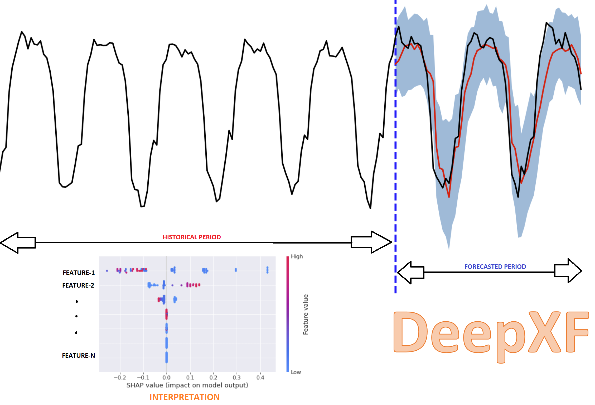

DeepXF: Explainable Forecasting and Nowcasting with State-of-the-art Deep Neural Networks and Dynamic Factor Model
==================================================================================================================
Also, verify TS signal similarities and Filtering of TS signals with single line of code at ease
================================================================================================

**deep-xf**

pypi: https://pypi.org/project/deep_xf

**Related Blog:** https://towardsdatascience.com/interpretable-nowcasting-with-deepxf-using-minimal-code-6b16a76ca52f

**Related Blog:** https://medium.com/analytics-vidhya/building-explainable-forecasting-models-with-state-of-the-art-deep-neural-networks-using-a-ad3fa5844fef

**Related Blog:** https://towardsdatascience.com/learning-similarities-between-biomedical-signals-with-deep-siamese-network-7684648e2ba0

**Related Blog:** https://ajay-arunachalam08.medium.com/denoising-ecg-signals-with-ensemble-of-filters-65919d15afe9

About deep-xf
=============

`DeepXF` is an open source, low-code python library for forecasting and nowcasting tasks. `DeepXF` helps in designing complex forecasting and nowcasting models with built-in utility for time series data. One can automatically build interpretable deep forecasting and nowcasting models at ease with this `simple`, `easy-to-use` and `low-code` solution. It enables users to perform end-to-end Proof-Of-Concept (POC) quickly and efficiently. One can build models based on deep neural network such as Recurrent Neural Network (RNN), Long Short Term Memory (LSTM), Gated Recurrent Unit (GRU), Bidirectional RNN/LSTM/GRU (BiRNN/BiLSTM/BiGRU), Spiking Neural Network (SNN), Graph Neural Network (GNN), Transformers, Generative Adversarial Network (GAN), Convolutional Neural Network (CNN), and others. It also provides facility to build nowcast model using Dynamic Factor Model. 

`DeepXF` is conceived and developed by Ajay Arunachalam - https://www.linkedin.com/in/ajay-arunachalam-4744581a/

Please Note:- This is still by large a work in progress, so always open to your comments and things you feel to be included. Also, if you want to be a contributor, you are always most welcome. The RNN/LSTM/GRU/BiRNN/BiLSTM/BiGRU are already part of the initial version roll-out, while the latter ones (SNN, GNN, Transformers, GAN, CNN, etc.) are work in progress, and will be added soon once the testing is completed. 

The library provides (not limited too):-
========================================

- Exploratory Data Analysis with services like profiling, filtering outliers, univariate/multivariate plots, plotly interactive plots, rolling window plots, detecting peaks, etc. 

- Data Preprocessing for Time-series data with services like finding missing, imputing missing, date-time extraction, single timestamp generation, removing unwanted features, etc. 

- Descriptive statistics for the provided time-series data, Normality evaluation, etc.

- Feature engineering with services like generating time lags, date-time features, one-hot encoding, date-time cyclic features, etc.

- **Finding similarity between homogeneous time-series inputs with Siamese Neural Networks.**

- **Denoising time-series input signals.**

- **Building Deep Forecasting Model with hyperparameters tuning and leveraging available computational resource (CPU/GPU).**

- **Forecasting model performance evaluation with several key metrics** 

- **Game theory based method to interpret forecasting model results.**

- **Building Nowcasting model with Expectation–maximization algorithm**

- **Explainable Nowcasting**

Who can use deep-xf?
====================

DeepXF is an open-source library ideal for:-

- Citizen Data Scientists who prefer a low code solution.
- Experienced Data Scientists who want to increase model accuracy and improve productivity.
- Data Science Professionals and Consultants involved in building proof-of-concept (poc) projects.
- Researchers for quick poc prototyping and testing.
- Students and Teachers.
- ML Enthusiasts.
- Learners.

Requirements
============

-  **Python 3.6.x**
-  torch[>=1.4.0]
-  NumPy[>=1.9.0]
-  SciPy[>=0.14.0]
-  Scikit-learn[>=0.16]
-  statsmodels[0.12.2]
-  Pandas[>=0.23.0]
-  Matplotlib
-  Seaborn[0.9.0]
-  tqdm
-  shap
-  keras[2.6.0]
-  pandas_profiling[3.1.0]
-  py-ecg-detectors

Quickly Setup package with automation scripts
=============================================

.. code:: bash

    sudo bash setup.sh

Installation
------------
Using pip:

.. code:: sh

    pip install deep-xf or pip3 install deep-xf or pip install git+git://github.com/ajayarunachalam/Deep_XF

.. code:: bash

    $ git clone https://github.com/ajayarunachalam/Deep_XF
    $ cd Deep_XF
    $ python setup.py install

Using notebook:

.. code:: sh

    !pip install deep-xf

Using conda:

.. code:: bash

	$ conda install -c conda-forge deep-xf

Getting started
===============

-  **FORECASTING DEMO:**

.. code:: python
	
	# set model config
	select_model, select_user_path, select_scaler, forecast_window = Forecast.set_model_config(select_model='rnn', select_user_path='./forecast_folder_path/', select_scaler='minmax', forecast_window=1)

	# select hyperparameters
	hidden_dim, layer_dim, batch_size, dropout, n_epochs, learning_rate, weight_decay = Forecast.hyperparameter_config(hidden_dim=64, 																				layer_dim = 3, batch_size=64, dropout = 0.2,                                													n_epochs = 30, learning_rate = 1e-3, weight_decay = 1e-6)

	# train model
	opt, scaler = Forecast.train(df=df_full_features, target_col='value', split_ratio=0.2, select_model=select_model,              select_scaler=select_scaler, forecast_window=forecast_window, batch_size=batch_size, hidden_dim=hidden_dim, layer_dim=layer_dim,dropout=dropout, n_epochs=n_epochs, learning_rate=learning_rate, weight_decay=weight_decay)

	# forecast for user selected period
	forecasted_data, ff_full_features, ff_full_features_ = Forecast.forecast(model_df, ts, fc, opt, scaler, period=25, fq='1h', select_scaler=select_scaler,)

	# interpret the forecasting result
	Helper.explainable_forecast(df_full_features, ff_full_features_, fc, specific_prediction_sample_to_explain=df_full_features.shape[0]+2, input_label_index_value=0, num_labels=1)

Example Illustration
--------------------

.. code:: python

    __author__ = 'Ajay Arunachalam'
    __version__ = '0.0.1'
    __date__ = '7.11.2021'

	from deep_xf.main import *
	from deep_xf.dpp import *
	from deep_xf.forecast_ml import *
	from deep_xf.forecast_ml_extension import *
	from deep_xf.stats import *
	from deep_xf.utility import *
	from deep_xf.denoise import *
	from deep_xf.similarity import *
	df = pd.read_csv('../data/PJME_hourly.csv')
	print(df.shape)
	print(df.columns)
	# set variables
	ts, fc = Forecast.set_variable(ts='Datetime', fc='PJME_MW')
	# get variables
	model_df, orig_df = Helper.get_variable(df, ts, fc)
	# EDA
	ExploratoryDataAnalysis.plot_dataset(df=model_df,fc=fc, title='PJM East (PJME) Region: estimated energy consumption in Megawatts (MW)')
	# Feature Engg
	df_full_features = Features.generate_date_time_features_hour(model_df, ['hour','month','day','day_of_week','week_of_year'])
	# generating cyclic features
	df_full_features = Features.generate_cyclic_features(df_full_features, 'hour', 24, 0)
	df_full_features = Features.generate_cyclic_features(df_full_features, 'day_of_week', 7, 0)
	df_full_features = Features.generate_cyclic_features(df_full_features, 'month', 12, 1)
	df_full_features = Features.generate_cyclic_features(df_full_features, 'week_of_year', 52, 0)
	# holiday feature
	df_full_features = Features.generate_other_related_features(df=df_full_features)
	select_model, select_user_path, select_scaler, forecast_window = Forecast.set_model_config(select_model='rnn', select_user_path='./forecast_folder_path/', select_scaler='minmax', forecast_window=1)

	hidden_dim, layer_dim, batch_size, dropout, n_epochs, learning_rate, weight_decay = Forecast.hyperparameter_config(hidden_dim=64, 																				layer_dim = 3, batch_size=64, dropout = 0.2,                                													n_epochs = 30, learning_rate = 1e-3, weight_decay = 1e-6)

	opt, scaler = Forecast.train(df=df_full_features, target_col='value', split_ratio=0.2, select_model=select_model,              select_scaler=select_scaler, forecast_window=forecast_window, batch_size=batch_size, hidden_dim=hidden_dim, layer_dim=layer_dim,dropout=dropout, n_epochs=n_epochs, learning_rate=learning_rate, weight_decay=weight_decay)

	forecasted_data, ff_full_features, ff_full_features_ = Forecast.forecast(model_df, ts, fc, opt, scaler, period=25, fq='1h', select_scaler=select_scaler,)

	Helper.explainable_forecast(df_full_features, ff_full_features_, fc, specific_prediction_sample_to_explain=df.shape[0]+1, input_label_index_value=0, num_labels=1)

-  **NOWCASTING DEMO:**

.. code:: python
	
	# set model config
	select_model, select_user_path, select_scaler, forecast_window = Forecast.set_model_config(select_model='em', select_user_path='./forecast_folder_path/', select_scaler='minmax', forecast_window=5)

	# nowcast for user selected window
	nowcast_full_data, nowcast_pred_data = EMModel.nowcast(df_full_features, ts, fc, period=5, fq='1h', forecast_window=forecast_window, 	select_model=select_model)

	# interpret the nowcasting model result
	EMModel.explainable_nowcast(df_full_features, nowcast_pred_data, fc, specific_prediction_sample_to_explain=df.shape[0]+2, input_label_index_value=0, num_labels=1)

Example Illustration
--------------------

.. code:: python

    __author__ = 'Ajay Arunachalam'
    __version__ = '0.0.1'
    __date__ = '7.11.2021'

	from deep_xf.main import *
	from deep_xf.dpp import *
	from deep_xf.forecast_ml import *
	from deep_xf.forecast_ml_extension import *
	from deep_xf.stats import *
	from deep_xf.utility import *
	from deep_xf.denoise import *
	from deep_xf.similarity import *
	df = pd.read_csv('./data/PJME_hourly.csv')
	# set variables
	ts, fc = Forecast.set_variable(ts='Datetime', fc='PJME_MW')
	# get variables
	model_df, orig_df = Helper.get_variable(df, ts, fc)
	select_model, select_user_path, select_scaler, forecast_window = Forecast.set_model_config(select_model='em', select_user_path='./forecast_folder_path/', select_scaler='minmax', forecast_window=5)
	df_full_features = Features.generate_date_time_features_hour(model_df, ['hour','month','day','day_of_week','week_of_year'])
	# generating cyclic features
	df_full_features = Features.generate_cyclic_features(df_full_features, 'hour', 24, 0)
	df_full_features = Features.generate_cyclic_features(df_full_features, 'day_of_week', 7, 0)
	df_full_features = Features.generate_cyclic_features(df_full_features, 'month', 12, 1)
	df_full_features = Features.generate_cyclic_features(df_full_features, 'week_of_year', 52, 0)
	df_full_features = Features.generate_other_related_features(df=df_full_features)
	nowcast_full_data, nowcast_pred_data = EMModel.nowcast(df_full_features, ts, fc, period=5, fq='1h', forecast_window=forecast_window, select_model=select_model)
	EMModel.explainable_nowcast(df_full_features, nowcast_pred_data, fc, specific_prediction_sample_to_explain=df.shape[0]+3, input_label_index_value=0, num_labels=1)

Tested Demo
===========
## Important Links
------------------
- Find the forecasting demo here : https://github.com/ajayarunachalam/Deep_XF/blob/main/demo_notebook/Forecast-Demo.py
- Find the notebook of the nowcasting demo here : https://github.com/ajayarunachalam/Deep_XF/blob/main/demo_notebook/Nowcast-Demo.ipynb

License
=======
Copyright 2021-2022 Ajay Arunachalam <ajay.arunachalam08@gmail.com>

Permission is hereby granted, free of charge, to any person obtaining a copy of this software and associated documentation files (the "Software"), to deal in the Software without restriction, including without limitation the rights to use, copy, modify, merge, publish, distribute, sublicense, and/or sell copies of the Software, and to permit persons to whom the Software is furnished to do so, subject to the following conditions:

The above copyright notice and this permission notice shall be included in all copies or substantial portions of the Software.

THE SOFTWARE IS PROVIDED "AS IS", WITHOUT WARRANTY OF ANY KIND, EXPRESS OR IMPLIED, INCLUDING BUT NOT LIMITED TO THE WARRANTIES OF MERCHANTABILITY, FITNESS FOR A PARTICULAR PURPOSE AND NONINFRINGEMENT. IN NO EVENT SHALL THE AUTHORS OR COPYRIGHT HOLDERS BE LIABLE FOR ANY CLAIM, DAMAGES OR OTHER LIABILITY, WHETHER IN AN ACTION OF CONTRACT, TORT OR OTHERWISE, ARISING FROM, OUT OF OR IN CONNECTION WITH THE SOFTWARE OR THE USE OR OTHER DEALINGS IN THE SOFTWARE. © 2021 GitHub, Inc.

